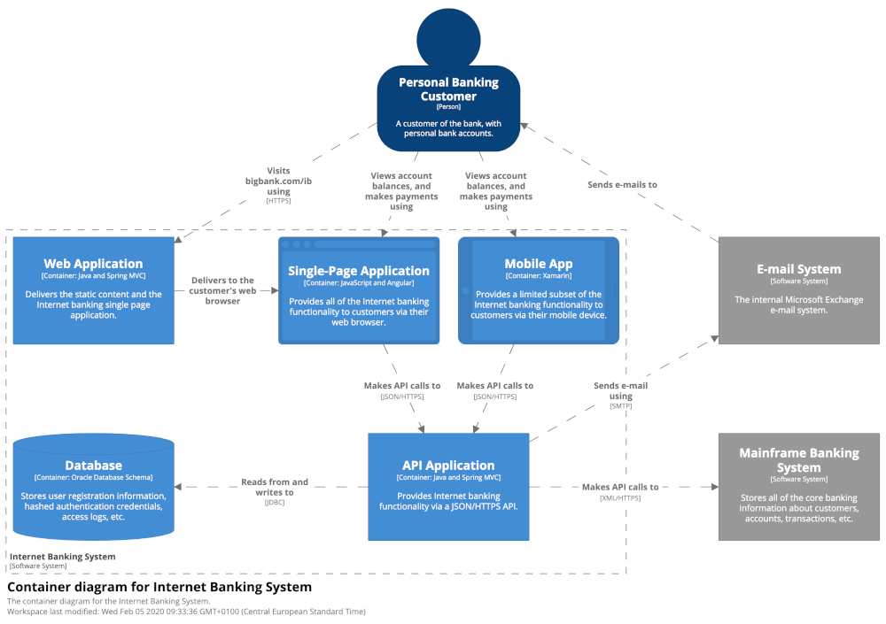
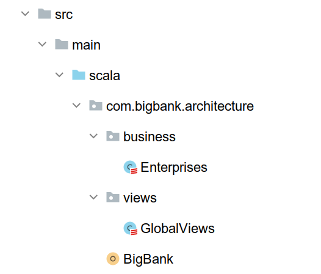
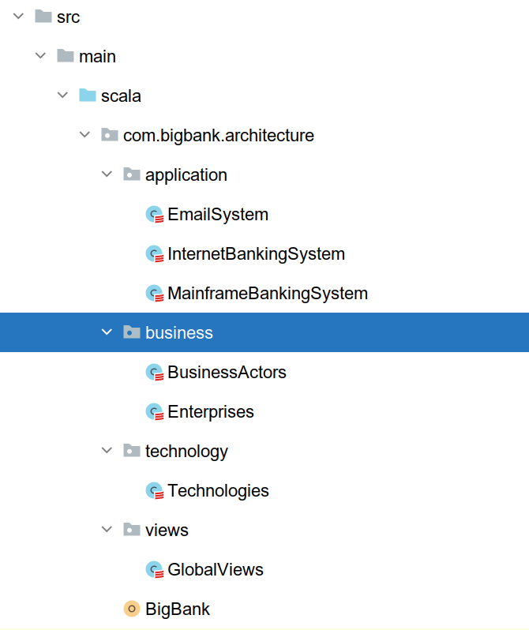
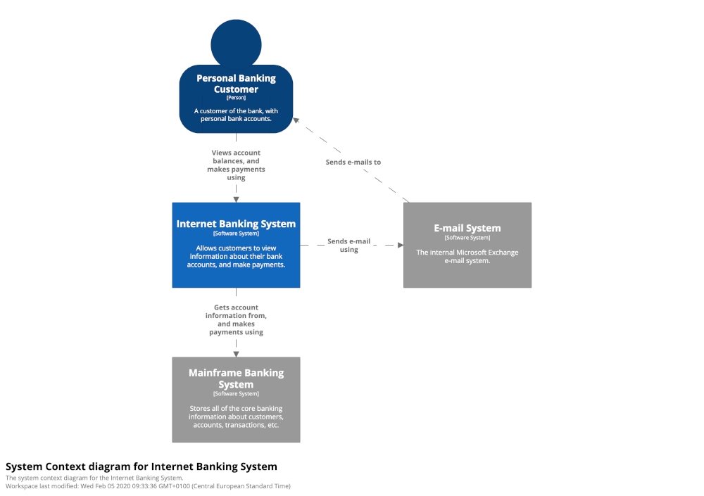
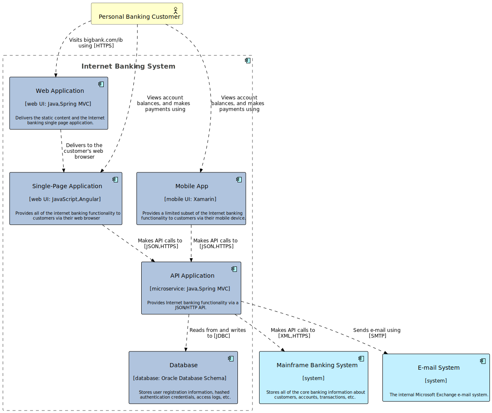

# C4 Model with Townplanner DSL

The Townplanner was initially heavily inspired by the [C4 Model](https://c4model.com), but it grew with more of a focus
on enterprise architecture. However, it is still possible to describe a C4 model, and to generate
diagrams such as the *System Context Diagram* and a *Container Diagram*.

Let's see how we can do this, in a new project. Our goal with this tutorial is to recreate the model visualized in the diagram below:



## Setup

Create a new Townplanner project with the following command
in the terminal (make sure you have Scala and SBT installed):

    sbt new innovenso/townplanner.g8

This will launch the template script, asking for a few arguments:

    name [Acme Inc. Town Plan]: Big Bank PLC
    version [1.0.0]: 1.0.0
    package [com.acme.architecture]: com.bigbank.architecture
    classname [Acme]: BigBank
    organization [com.acme.architecture]: com.bigbank.architecture

The result will be a directory called `big-bank-plc` with the following structure:



## Structure

Let's create a few classes to set up the model structure. We'll create 2 packages: `com.bigbank.architecture.application`, and `com.bigbank.architecture.technology`.
Inside the *application* package we create 3 case classes: `InternetBankingSystem`, `EmailSystem` and `Mainframe Banking System`, and in the *technology* package we create the case class `Technologies`.
In the `com.bigbank.architecture.business` package, we create another case class, called `BusinessActors`.

Now the project structure looks like this:



## Starting with the Technology Radar

Before describing the systems and the containers, let's describe all the technologies Big Bank PLC uses. These can then be assigned
to containers, and given an architecture verdict (TIME).

We need the `Technologies` class to have dependency injection for `EnterpriseArchitecture` and we need it to be part of the town plan.

```scala
package com.bigbank.architecture.technology

import com.innovenso.townplanner.model.EnterpriseArchitecture

case class Technologies()(implicit ea: EnterpriseArchitecture)
```

```scala
package com.bigbank.architecture
...

object BigBank extends EnterpriseArchitectureAsCode {
  implicit val enterprises: Enterprises = Enterprises()
  implicit val technologies: Technologies = Technologies()
...
}
```

Next, describe the individual technologies:

```scala
case class Technologies()(implicit ea: EnterpriseArchitecture) {
  val java: Language = ea has Language(title = "Java")
  val springMvc: Framework = ea has Framework(title = "Spring MVC")
  val javascript: Language = ea has Language(title = "JavaScript")
  val angular: Framework = ea has Framework(title = "Angular")
  val xamarin: Framework = ea has Framework(title = "Xamarin")
  val oracle: Language = ea has Language(title = "Oracle Database Schema")
  val jdbc: Language = ea has Language(title = "JDBC")
  val json: Language = ea has Language(title = "JSON")
  val xml: Language = ea has Language(title = "XML")
  val https: Language = ea has Language(title = "HTTPS")
  val smtp: Language = ea has Language(title = "SMTP")
}
```

We can do a lot more with technologies than just list them, but that is part of another guide.

## Describing Mainframe Banking System

Let's start describing the Mainframe Banking System. We need to set up the dependency injection `EnterpriseArchitecture` on
the MainframeBankingSystem class, and add the class to the town plan.

```scala
package com.bigbank.architecture.application

import com.innovenso.townplanner.model.EnterpriseArchitecture

case class InternetBankingSystem()(implicit ea: EnterpriseArchitecture)
```

```scala
package com.bigbank.architecture

...

object BigBank extends EnterpriseArchitectureAsCode {
  implicit val enterprises: Enterprises = Enterprises()
  implicit val mainframe: MainframeBankingSystem = MainframeBankingSystem()
  implicit val globalViews: GlobalViews = GlobalViews()

  // generates diagrams for all views
  diagrams()

...

}
```

Inside the `MainframeBankingSystem` class, let's describe the system:

```scala
case class MainframeBankingSystem()(implicit ea: EnterpriseArchitecture) {
  val system: ItSystem =
    ea describes ItSystem(title = "Mainframe Banking System") as { it =>
      it has Description(
        "Stores all of the core banking information about customers, accounts, transactions, etc."
      )
    }
}
```

We don't want a view for this system itself, so we're done here. Let's move on to the email system.

## Describing Email System

Same as with the mainframe system, we set up dependency injection of `EnterpriseArchitecture`, add the system to the town plan in `BigBank`, and describe the system:

```scala
object BigBank extends EnterpriseArchitectureAsCode {
  implicit val enterprises: Enterprises = Enterprises()
  implicit val mainframe: MainframeBankingSystem = MainframeBankingSystem()
  implicit val email: EmailSystem = EmailSystem()
  implicit val globalViews: GlobalViews = GlobalViews()

...
}
```

```scala
case class EmailSystem()(implicit ea: EnterpriseArchitecture) {
  val system: ItSystem = ea describes ItSystem(title = "E-mail System") as {
    it =>
      it has Description("The internal Microsoft Exchange e-mail system.")
  }
}
```

Once again, we don't need a specialized view for this system, so let's move on.

## Describing the Internet Mailing System

This one is more interesting, as we want to describe the *containers* inside the system, as well the relationships with the other systems and with the user.

Start with dependency injection again. This time, we need dependencies on the `EmailSystem` and the `MainframeBankingSystem`, as well as on the `EnterpriseArchitecture`.

```scala
case class InternetBankingSystem()(implicit
                                   ea: EnterpriseArchitecture,
                                   emailSystem: EmailSystem,
                                   mainframeBankingSystem: MainframeBankingSystem,
                                   technologies: Technologies
)
```

Because these classes must be known already, we declare the IBS behind them in the main class:

```scala
object BigBank extends EnterpriseArchitectureAsCode {
  implicit val enterprises: Enterprises = Enterprises()
  implicit val mainframe: MainframeBankingSystem = MainframeBankingSystem()
  implicit val email: EmailSystem = EmailSystem()
  implicit val ibs: InternetBankingSystem = InternetBankingSystem()
  implicit val globalViews: GlobalViews = GlobalViews()
...  
}
```

Let's describe the system itself first. As we can see in the System Context Diagram on the C4 Model website, the system interacts with both the mainframe and the e-mail system.



```scala
val system: ItSystem =
  ea describes ItSystem(title = "Internet Banking System") as { it =>
    it has Description(
      "Allows customers to view information about their bank accounts, and make payments"
    )

    it uses (mainframeBankingSystem.system, "Gets account information from, and makes payments using")
    it uses (emailSystem.system, "Sends e-mail using")
  }
```

### The IBS database

The database is a simple Oracle database, which we describe in the `InternetBankingSystem` class:

```scala
  val database: Database = ea describes Database(title = "Database") as { it =>
    it has Description(
      "Stores user registration information, hashed authentication credentials, access logs, etc."
    )
    it isImplementedBy technologies.oracle
    it isPartOf system
  }
```

### The IBS API

The API is a microservice built with Java and Spring MVC, that uses the database for storage, the mainframe for business logic and the e-mail system for sending emails. Once again, we describe it in the `InternetBankingSystem` class. 

```scala
  val api: Microservice =
    ea describes Microservice(title = "API Application") as { it =>
      it has Description(
        "Provides Internet banking functionality via a JSON/HTTP API."
      )
      
      it isImplementedBy technologies.java
      it isImplementedBy technologies.springMvc
      
      it isPartOf system
      
      it does "Reads from and writes to" on database and { that =>
        that isImplementedBy technologies.jdbc
      }
      it does "Makes API calls to" on mainframeBankingSystem.system and {
        that =>
          that isImplementedBy technologies.xml
          that isImplementedBy technologies.https
      }
      it does "Sends e-mail using" on emailSystem.system and { that =>
        that isImplementedBy technologies.smtp
      }
    }
```

Note that relationships can be written in a fluent syntax, which also allows to assign technologies to them, and to give descriptions.

### The IBS frontend

There are 3 frontend containers in the IBS system, a webapp, a SPA and a mobile app, which we describe in the `InternetBankingSystem` class.

```scala
  val webapp: WebUI = ea describes WebUI(title = "Web Application") as { it =>
    it has Description(
      "Delivers the static content and the Internet banking single page application."
    )
    it isImplementedBy technologies.java
    it isImplementedBy technologies.springMvc
    it isPartOf system
  }

  val spa: WebUI = ea describes WebUI(title = "Single-Page Application") as {
    it =>
      it has Description(
        "Provides all of the internet banking functionality to customers via their web browser"
      )
      it isImplementedBy technologies.javascript
      it isImplementedBy technologies.angular
      it isPartOf system
      it isUsedBy (webapp, "Delivers to the customer's web browser")
      it does "Makes API calls to" on api and { that =>
        that isImplementedBy technologies.json
        that isImplementedBy technologies.https
      }
  }

  val mobileApp: MobileUI = ea describes MobileUI(title = "Mobile App") as {
    it =>
      it has Description(
        "Provides a limited subset of the Internet banking functionality to customers via their mobile device."
      )
      it isImplementedBy technologies.xamarin
      it isPartOf system
      it does "Makes API calls to" on api and { that =>
        that isImplementedBy technologies.json
        that isImplementedBy technologies.https
      }
  }
```

## Describing the user

The last piece of the puzzle is the customer, and we will describe this in the `BusinessActors` class. We need to set up dependency injection first, with the technologies, and with IBS and email:

```scala
case class BusinessActors()(implicit
    ea: EnterpriseArchitecture,
    internetBankingSystem: InternetBankingSystem,
    emailSystem: EmailSystem,
    technologies: Technologies
)
```

```scala
object BigBank extends EnterpriseArchitectureAsCode {
  implicit val enterprises: Enterprises = Enterprises()
  implicit val technologies: Technologies = Technologies()
  implicit val mainframe: MainframeBankingSystem = MainframeBankingSystem()
  implicit val email: EmailSystem = EmailSystem()
  implicit val ibs: InternetBankingSystem = InternetBankingSystem()
  implicit val businessActors: BusinessActors = BusinessActors()
  implicit val globalViews: GlobalViews = GlobalViews()
...
} 
```

We only have one customer, so that should be quite simple:

```scala
  val customer: Actor =
    ea describes Actor(title = "Personal Banking Customer") as { she =>
      she has Description(
        "A customer of the bank, with personal bank accounts."
      )
      she does "Visits bigbank.com/ib using" on internetBankingSystem.webapp and {
        that =>
          that isImplementedBy technologies.https
      }
      she uses (internetBankingSystem.spa, "Views account balances, and makes payments using")
      she uses (internetBankingSystem.mobileApp, "Views account balances, and makes payments using")
      she isUsedBy (emailSystem.system, "Sends e-mails to")
    }
```

## Requesting the views

For this example we only need one view: a System Container view of the Internet Banking System. We need to request that in the town plan. Let's do that in the `InternetBankingSystem` class:

```scala
  ea needs SystemContainerView(system)
```

## The result



This diagram is using Archimate notation, but showing the same information as a pure C4 diagram. The layout is different than the example on the C4 website, due to the automatic layout of PlantUML.

We are also working on a pure C4 notation of the diagram, that should be released in the coming days.
