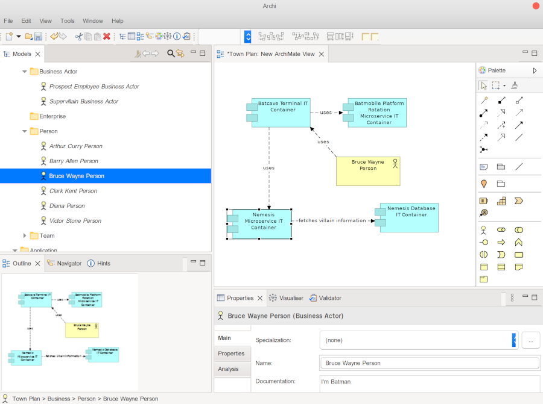

# Archimate

The Townplanner can export the full town plan to an OpenExchange XML file. Requesting this export is as simple as 
adding 1 line to the main class of the town plan:

```scala
object WayneEnterprisesTownPlan extends EnterpriseArchitectureAsCode {
  implicit val enterprises: Enterprises = Enterprises()
  implicit val capabilities: BusinessCapabilities = BusinessCapabilities()
  implicit val actors: Actors = Actors()
  implicit val technologyRadar: Technologies = Technologies()
  implicit val buildingBlocks: BuildingBlocks = BuildingBlocks()
  implicit val systems: Systems = Systems()

  val views: Views = Views()

  diagrams()
  archimate()
  documents()
  website()
}
```

On line 12 of the town plan, the command `archimate()` results in the file `output/assets/exports/openexchange.xml`.

This XML file will also be added to the *Enterprise* page of the static website, if you choose to have that built.

The OpenExchange XML file can be imported in tools like [Archi](https://www.archimatetool.com/) and [Sparx EA](https://www.sparxsystems.eu/).

## Examples
### Imported in Archi

