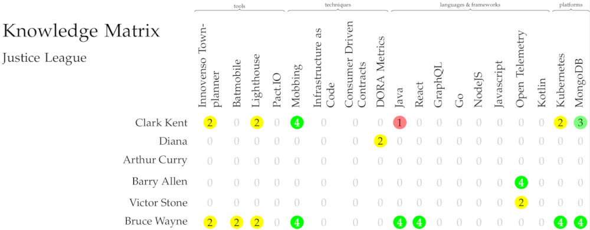

# Knowledge Matrix

Once you have created a [technology radar](techradar.md), it's usually good, and in case of ISO9001 certification
a requirement, to know what skills are present in your company, so that you can plan training or recruitment.
A simple competence matrix can be a useful tool for this.

## Assigning knowledge

Using the *knowledge* relationship in the Townplanner, it is possible to indicate the level of expertise a
person or team has in a given technology, be it a tool, a technique, language, framework or platform.

```scala
val bruceWayne: Person = ea describes Person(title = "Bruce Wayne") as { he =>
  ...
  he knows(target=technologies.java, level = Expert)
  ...
}
```

The levels of knowledge are *NoKnowledge*, *Learner*, *Knowledgeable*, *HighlyKnowledgeable*, *Expert*. The default level when the parameter is omitted is *Knowledgeable*.

## Assigning teams
Now, with people assigned to teams, it is possible to request a knowledge matrix for that team, that will visualize the expertise
within the team, for all entries in the Technology Radar.

```scala
val justiceLeague: Team = ea has Team(title = "Justice League")

val bruceWayne: Person = ea describes Person(title = "Bruce Wayne") as { he =>
  ...
  he isPartOf justiceLeague
  ...
}

ea needs KnowledgeMatrix(forTeam = justiceLeague)
```

## Output

The result is a PDF file, containing a one-page visualization of the expertise in the Justice League team.


