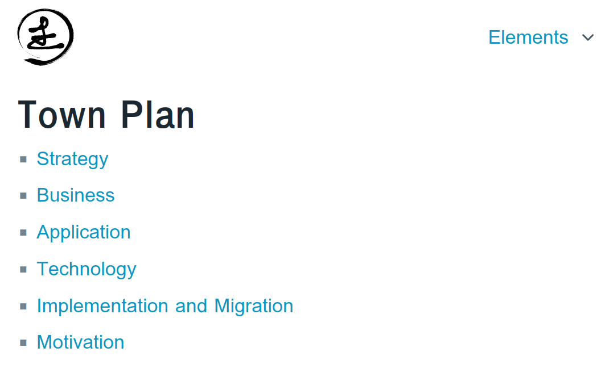
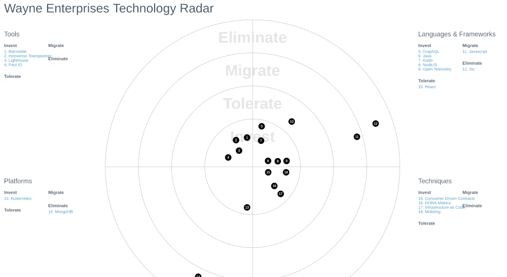
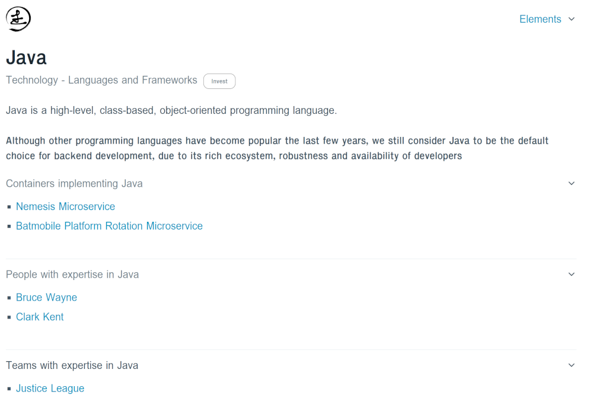
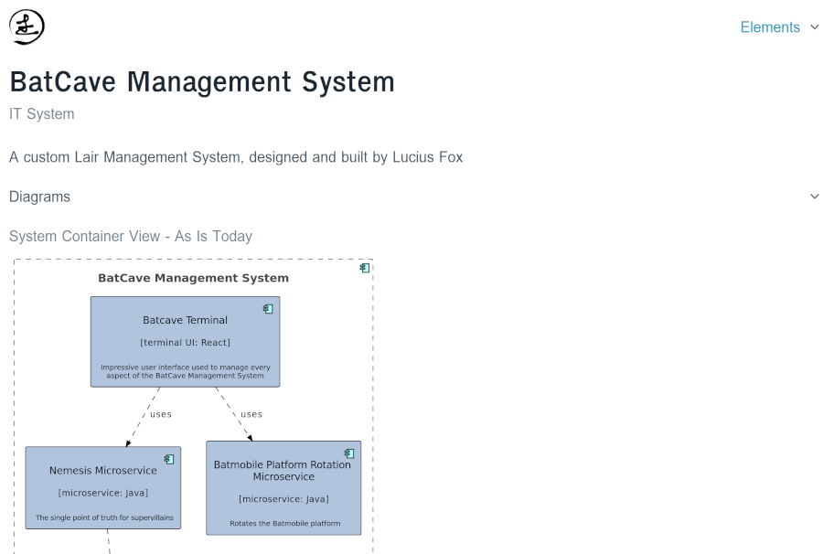

# Static Website

By adding the instruction `website()` to the end of the town plan main class, you can have a static website rendered,
containing all the information in the town plan, including diagrams, documents and exports (if you have chosen to build those).

```scala
object WayneEnterprisesTownPlan extends EnterpriseArchitectureAsCode {
  implicit val enterprises: Enterprises = Enterprises()
  implicit val capabilities: BusinessCapabilities = BusinessCapabilities()
  implicit val actors: Actors = Actors()
  implicit val technologyRadar: Technologies = Technologies()
  implicit val buildingBlocks: BuildingBlocks = BuildingBlocks()
  implicit val systems: Systems = Systems()

  val views: Views = Views()

  diagrams()
  archimate()
  documents()
  website()
}
```

Note that in order to have the diagrams, documents and Archimate exports included in the static website, those instructions
should come *before* the `website()` instruction.

## Examples
### Home Page

### Technology Radar

### Technology Detail

### System Overview Page

