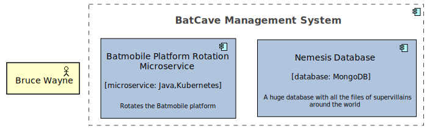

# Getting Started

A Townplanner project is a Scala project, with a dependency to the townplanner libraries. Don't worry, you don't really need to know a lot of Scala, just the basics. For any Java developer, this should take just a few hours to get familiar with.

## Prerequisites

You need the following software installed on your computer to use the Townplanner Gradle Plugin:

- Java Development Kit 17
- Scala 2.13
- SBT (Scala Build Tool) 1.6.2 or higher
- Graphviz, any version [supported by PlantUML](https://plantuml.com/faq)
- NodeJS with NPM (if you want to use Technology Radar export)
- Blender 2.80 or higher (if you want to use Blender export)
- Git (if you want to version control your town plan)
- Intellij Idea or Eclipse to edit the town plan (it's Scala after all!)
- LaTeX (if you want to use Document export)

## Project setup

### Directory structure

Create a directory for your town plan project:

    mkdir wayne-enterprises-townplan
    cd wayne-enterprises-townplan
    mkdir -p src/main/scala/com/wayneenterprises/townplan

### Build configuration

Now we create a `build.sbt` file in the root directory of the project:

```scala
ThisBuild / organization := "com.wayneenterprises.architecture"
ThisBuild / version := "1.0.0"
ThisBuild / scalaVersion := "2.13.8"
ThisBuild / resolvers += Resolver.mavenLocal

lazy val townplan = project
    .in(file("."))
    .settings(
        name := "wayneenterprises-townplan",
        libraryDependencies += "com.innovenso.townplanner" % "innovenso-townplanner-application_2.13" % "1.11.1"
    )
```

Next we create the SBT config file, `build.properties`, in the `project` directory of the project.

```
sbt.version=1.6.2
```

### Setting up the town plan

The town plan is basically a command-line application, written in scala, where you define the elements and relationships using a domain-specific language. We therefore need to start with a Hello World.

Let's create the main entry point for our town plan in `src/main/scala/com/wayneenterprises/townplan/WayneEnterprisesTownPlan.scala`:

```scala
package com.wayneenterprises.townplan

...

object WayneEnterprisesTownPlan extends EnterpriseArchitectureAsCode {
    println("Hello World, this is the Wayne Enterprises Town Plan")   

    diagrams()
}
```

When we run this application with `sbt run` on the command line, the Hello World message will be shown in the console, and nothing else will happen, because we haven't added anything yet.

Now when we want to add concepts to the town plan, we put them between line 6 and 8. But unless the town plan is very small, we should divide it into classes.

## The Town Plan

### Hello world

We're good to go! Let's add the enterprise itself, which is an element in the town plan:

```scala
val wayneCorp: Enterprise =
    ea describes Enterprise(title = "Wayne Enterprises") as { it =>
        it has Description("Wayne Enterprises, Inc., also known as WayneCorp is a fictional company appearing in American comic books published by DC Comics, commonly in association with the superhero Batman. Wayne Enterprises is a large, growing multinational company.")
}

ea needs BusinessCapabilityMap(forEnterprise = enterprises.wayneCorp)
ea needs FullTownPlanView(forEnterprise = enterprises.wayneCorp)
```
As you can see, the enterprise Wayne Enterprises is described as an *element* in the town plan, with a title and a description. In order to have some output, we need some views. For enterprises,
we can request a Business Capability Map and a Full Town Plan.

Let's render and see what we get! On the command line, type the following command: 

```
sbt run
```
This renders both the business capability map, as well as the full town plan to SVG, EPS and PNG, in the `output` directory.

The `output` directory will now contain a subdirectory `assets`, which in turn has directories for Application and Strategy. The Townplanner uses
the *layers* of Archimate to organize the outputs. 

When we at the images in `output/assets/Application/Wayne Enterprises/As Is Today` and in `output/assets/Strategy/Wayne Enterprises`, it's no 
surprise that there is not much there for the moment. We'll add some more content in the next section.


Note that we're using Archimate style diagrams, in most cases properly, but in this example a bit unorthodox,
as we are using the *physical facility* notation for the enterprise. 

### A bit more interesting town plan

When I started working on the Town Planner, I was inspired by [Structurizr and C4](https://structurizr.com/), because I really like the readability of a C4 container diagram. So let's create a model to demonstrate the C4 Container diagram,
and add a few extras on top.

First, let's divide the town plan definition into manageable chunks, using classes.

We put the enterprise in its own class, `com.wayneenterprises.townplan.strategy.Enterprises`:

```scala
package com.wayneenterprises.townplan.strategy

...

case class Enterprises()(implicit ea: EnterpriseArchitecture) {
    val wayneCorp: Enterprise =
        ea describes Enterprise(title = "Wayne Enterprises") as { it =>
            it has Description(
                "Wayne Enterprises, Inc., also known as WayneCorp is a fictional company appearing in American comic books published by DC Comics, commonly in association with the superhero Batman. Wayne Enterprises is a large, growing multinational company."
            )
        }
}
```

We also put the Views in a class, `com.wayneenterprises.townplan.views.Views`:
    
```scala
package com.wayneenterprises.townplan.views

...

case class Views()(implicit ea: EnterpriseArchitecture, enterprises: Enterprises) {
    ea needs BusinessCapabilityMap(forEnterprise = enterprises.wayneCorp)
    ea needs FullTownPlanView(forEnterprise = enterprises.wayneCorp)
}
```

Now the main class looks like this:

```scala
package com.wayneenterprises.townplan

...

object WayneEnterprisesTownPlan extends EnterpriseArchitectureAsCode {
    println("Hello World, this is the Wayne Enterprises Town Plan")   
    implicit val enterprises: Enterprises = Enterprises()

    val views: Views = Views()

    diagrams
}
```

Let's add some business capabilities, in `com.wayneenterprises.townplan.strategy.BusinessCapabilities`:

```scala
package com.wayneenterprises.townplan.strategy

...

case class BusinessCapabilities()(implicit ea: EnterpriseArchitecture, enterprises: Enterprises) {
    val offeringSuperheroServices: BusinessCapability = ea describes BusinessCapability(title="Offering Superhero Services") as { it =>
        it serves enterprises.wayneCorp
    }
    val managingSecretLairs: BusinessCapability = ea describes BusinessCapability(title="Managing Secret Lairs") as { it =>
        it serves offeringSuperheroServices
        it has Description("Every enterprise that serves as the cover for a superhero needs secret lairs. And when you have secret lairs, you need to manage them.")
    }
    val enterpriseSupport: BusinessCapability = ea describes BusinessCapability(title="Enterprise Support") as { it =>
        it serves enterprises.wayneCorp
    }
    val accounting: BusinessCapability = ea describes BusinessCapability(title = "Accounting") as { it =>
        it serves enterpriseSupport
    }
}
```

Business Capabilities are typically a hierarchy, _serving_ an enterprise, and _serving_ their parent capabilities. `it serves ...` defines a Serving Relationship. 

Next, we define an Architectural Building Block that will realize the Secret Lairs capability, in class `com.wayneenterprises.townplan.application.BuildingBlocks`.

```scala
package com.wayneenterprises.townplan.application

...

case class BuildingBlocks()(implicit ea: EnterpriseArchitecture, capabilities: BusinessCapabilities, enterprises: Enterprises) {
    val lairManagement: ArchitectureBuildingBlock =
        ea describes ArchitectureBuildingBlock(title = "Lair Management") as { it =>
            it realizes capabilities.managingSecretLairs
            it serves enterprises.wayneCorp
        }
}
```

We see our second type of relationship here: `it realizes ...`. This means that the building block has a directed relationship to *managingSecretLayers*, with the default title of *realizes*.

Before we add the system that realizes this building block, let's add some technologies first. Technologies are also elements, with an architecture recommendation and a type. They can be used to generate a Technology Radar. See the [Technology DSL](dsl/technologies.md) for more information. We will create a separate class to define the technologies, `com.wayneenterprises.townplan.technology.TechnologyRadar`.

```scala
package com.wayneenterprises.townplan.technology

...

case class TechnologyRadar()(implicit ea: EnterpriseArchitecture) {
    val java: Language = ea describes Language(title = "Java") as { it =>
        it has Description("Java is a high-level, class-based, object-oriented programming language.")
        it should BeInvestedIn("Although other programming languages have become popular the last few years, we still consider Java to be the default choice for backend development, due to its rich ecosystem, robustness and availability of developers")
    }
    
    val kubernetes: Platform = ea describes Platform(title = "Kubernetes") as { it =>
        it has Description("Kubernetes is an open-source container orchestration system for automating software deployment, scaling, and management.")
        it should BeInvestedIn("For now, Kubernetes is the best bet for cloud applications, since it is supported by all major public clouds and as such leaves the door open for a multi-cloud strategy.")
    }
    
    val react: Framework = ea describes Framework(title = "React") as { it =>
        it has Description("React is a free and open-source front-end JavaScript library[3] for building user interfaces based on UI components.")
        it should BeTolerated("At Wayne Enterprises we prefer to take the HTML/CSS-first approach, rather than the Javascript-first approach made popular by SPA in recent years.")
    }
    
    val mongodb: Platform = ea describes Platform(title = "MongoDB") as { it =>
        it has Description("MongoDB is a source-available cross-platform document-oriented database program.")
        it should BeEliminated("As we are moving to a fully event-sourced architecture, we prefer a databaseless approach.")
    }
}
```

We have defined 4 technologies.

- A *Language* called Java, with an architecture verdict of *Invest*.
- A *Platform* called Kubernetes, with an architecture verdict of *Invest*.
- A *Framework* called React, with an architecture verdict of *Tolerate*.
- A *Platform* called MongoDB, with an architecture verdict of *Eliminate*.

Note that all of the above is in fact optional if you only want to render a C4 Container diagram. Let's get to the required part, where we describe the systems and containers. We put this in the class `com.wayneenterprises.townplan.application.Systems`.

```scala
package com.wayneenterprises.townplan.application

...

case class Systems()(implicit ea: EnterpriseArchitecture, enterprises: Enterprises, technologyRadar: TechnologyRadar, capabilities: BusinessCapabilities, buildingBlocks: BuildingBlocks) {
    val batCaveDestructionDay: Day = Day(2027, 10, 31)

    val bcms: ItSystem = 
        ea describes ItSystem(title = "BatCave Management System") as { it =>
            it has Description("A custom Lair Management System, designed and built by Lucius Fox")
            it realizes buildingBlocks.lairManagement
        }
    
    val nemesisDb: Database =
        ea describes Database(title = "Nemesis Database") as { it =>
            it has Description("A huge database with all the files of supervillains around the world")
            it isPartOf bcms
            it isImplementedBy technologyRadar.mongodb
        }

    val nemesisMs: Microservice =
        ea describes Microservice(title = "Nemesis Microservice") as { it =>
            it has Description("The single point of truth for supervillains")
            it isPartOf bcms
            it isImplementedBy technologyRadar.java
            it isImplementedBy technologyRadar.kubernetes
            it uses (target = nemesisDb, title = "fetches villain information")
        }

    val platformMs: Microservice =
        ea describes Microservice(title = "Batmobile Platform Rotation Microservice") as { it =>
            it has Description("Rotates the Batmobile platform")
            it isPartOf bcms
            it isImplementedBy technologyRadar.java
            it isImplementedBy technologyRadar.kubernetes
        }

    val bcmsUi: TerminalUI =
        ea describes TerminalUI(title = "Batcave Terminal") as { it =>
            it has Description("Impressive user interface used to manage every aspect of the BatCave Management System")
            it isPartOf bcms
            it isImplementedBy technologyRadar.react
            it uses nemesisMs
            it uses platformMs
        }
}
```

We have defined an IT System, called the *BatCave Management System* which has 4 containers, 1 database, 2 microservices and 1 UI. Each of them have technologies and *flow* relationships between them.

All we need now is the *business actor* to use the system, which we do again in a separate class `com.wayneenterprises.townplan.business.Actors`:

```scala
package com.wayneenterprises.townplan.business

...

case class Actors()(implicit ea: EnterpriseArchitecture, enterprises: Enterprises, systems: Systems) {
    val robin: Actor = ea describes Actor(title = "Prospect Employee") as { he =>
        he serves enterprises.wayneCorp
    }

    val justiceLeague: Team = ea describes Team(title = "Justice League") as { it =>
        it serves enterprises.wayneCorp
        it has Description("Superheroes fighting powerful enemies together")
        it has Wiki("https://nl.wikipedia.org/wiki/Justice_League_(film)")
    }

    val bruceWayne: Actor = ea describes Actor(title = "Bruce Wayne") as { he =>
        he has Description("I'm Batman")
        he isPartOf justiceLeague
        he serves enterprises.wayneCorp
        he has Description("Bruce lost his parents at a young age, and has been a bit strange ever since.")
        he has Website("https://linkedin.com/brucewayne")
        
        he has Strength("he has lots of gadgets")
        he has Strength("Alfred helps him a lot")
        he has Weakness("He is a bit traumatized and unstable")
        he has Threat("He seems to have a conflict with Superman, which is not the best idea in the world")
        he has Opportunity("if he works together with the Justice League, he will be much stronger")

        he uses systems.bcms
        he uses systems.bcmsUi
    }
}
```

The actors class has a bit more information than needed for the system container diagram. Let's look at the properties:

- most elements can have one or more descriptions
- most elements can have links to websites, wiki pages, production environments, api documentation, etc.
- some elements, including Business Actors, can have a SWOT analysis, as can be seen in Bruce Wayne. This information is not used in our C4 diagram of course, but can be used in documents, presentation slides, analytics, ...

We also have a new relationship `he isPartOf justiceLeague`, which is a Composition relationship in the Archimate language.

Note that we explicitly indicate that Batman uses the system, as well as the container. This is a design choice based on Structurizr. We might add the feature soon that automatically adds the actor-system relationship, when an actor-container relationship exists.

Finally, now that we have all the required elements, we want some extra views added in `com.wayneenterprises.townplan.views.Views`:

```scala
    ea needs ArchitectureBuildingBlockRealizationView(forBuildingBlock = buildingBlocks.lairManagement)
    ea needs SystemContainerView(forSystem = systems.bcms)
```

So, what does all this information give us? Let's find out:

    sbt run

#### Business Capability Map


#### Town Plan (mainly for bragging rights)


#### Architecture Building Block Simple View


#### Architecture Building Block Detail View


#### Container Diagram - AS IS


### Time Machine

You may have noticed that some directories end in *AS IS Today*. Does that mean we can also generate *TO BE Diagrams*? Yes it does, let's find out how:

Let's add the lifecycle to the BatCave Management System.

The database:

```scala
it has StartedDevelopment(description = "Ra's al Ghul came to town") on Day(2003, 1, 1)
it has GoneToProduction(description = "Just in time for the Joker") on Day(2005, 1, 1)
it is Decommissioned(description = "The Batcave is destroyed") on batCaveDestructionDay
```

The microservice:

```scala
it has StartedDevelopment(description = "Lucius Fox gets excited over microservices") on Day(2014, 1, 1)
it has GoneToProduction(description = "Even Batman is not immune to microservices") on Day(2015, 1, 1)
it is Decommissioned(description = "The Batcave is destroyed") on batCaveDestructionDay
```

The rotating platform was always there, because it's cool:

```scala
it is Decommissioned(description = "The Batcave is destroyed") on batCaveDestructionDay
```

and the UI was the last to be added:

```scala
it has StartedDevelopment(description = "Lucius Fox gets excited over SPA") on Day(2017, 1, 1)
it has GoneToProduction(description = "Even Batman is not immune to the SPA antipattern") on Day(2018, 1, 1)
it is Decommissioned(description = "The Batcave is destroyed") on batCaveDestructionDay
```

Let's build the model again and generate all the diagrams:

    sbt run

#### Container Diagram AS WAS at point in time 1

In the beginning, there is only a rotating platform.


#### Container Diagram AS WAS at point in time 2

The database was added.



#### Container Diagram AS IS Today

In the current state, the microservice and UI were added. The database did not change since the last point in time.


#### Container Diagram TO BE

In the end, everything is decommissioned. The BCMS is an empty system.


## Conclusion

We have only touched a part of what the Townplanner can do. As this documentation grows, check out
the pages on the DSL. I will add a lot more examples there.
