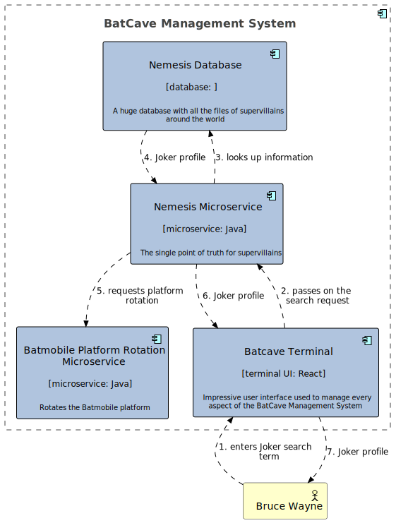
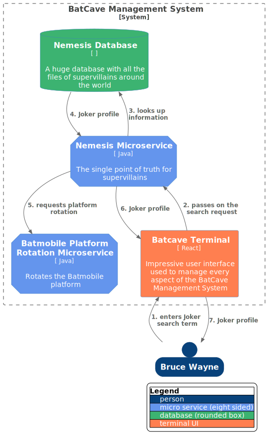
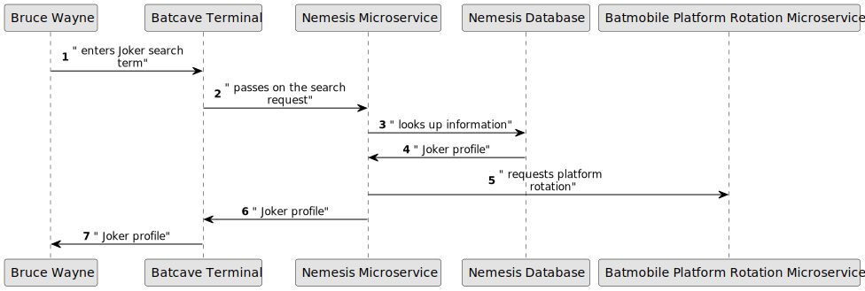

# Flow View

In addition to the standard C4 diagrams like the System Container View that focus on one system, sometimes it's useful 
to have a view of a data flow through several systems and/or containers. The flow view allows just that,
and results in a flow diagram and a sequence diagram when rendered.

## Defining the flow

You can define a flow anywhere in the town plan, as long as you can reference the participants of the flow.
The flow is described as a series of interactions between elements (systems, containers and actors).

An interaction can be a *request*, *response* or a *message*.

```scala
ea needs FlowView(title = "The Joker Flow") and { it =>
  it has Request("enters Joker search term") from actors.bruceWayne to systems.bcmsUi
  it has Request("passes on the search request") from systems.bcmsUi to systems.nemesisMs
  it has Request("looks up information") from systems.nemesisMs to systems.nemesisDb
  it has Response("Joker profile") from systems.nemesisDb to systems.nemesisMs
  it has Message("requests platform rotation") from systems.nemesisMs to systems.platformMs
  it has Response("Joker profile") from systems.nemesisMs to systems.bcmsUi
  it has Response("Joker profile") from systems.bcmsUi to actors.bruceWayne
}
```

When the townplan is instructed to render diagrams, the code above will result in the following 3 files:

## Output
### Flow

### C4 Flow

### Sequence

