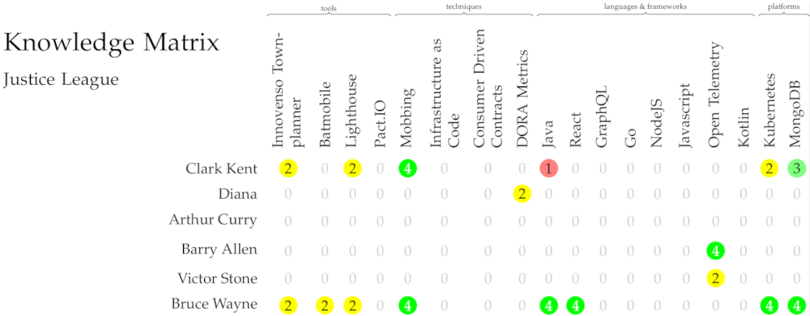

# Knowledge Matrix

Once you have created a [technology radar](techradar.md), it's usually good, and in case of ISO certification
a requirement, to know what skills are present in your company, so that you can plan training or recruitment.
A simple competence matrix can be a useful tool for this.

## Assigning knowledge

Using the *knowledge* relationship in the Townplanner, it is possible to indicate the level of expertise a
person or team has in a given technology, be it a tool, a technique, language, framework or platform.

```scala
val bruceWayne: Person = ea describes Person(title = "Bruce Wayne") as { he =>
  ...
  he knows(target=technologies.java, level = Expert)
  ...
}
```

The levels of knowledge are *NoKnowledge*, *Learner*, *Knowledgeable*, *HighlyKnowledgeable*, *Expert*. The default level when the parameter is omitted is *Knowledgeable*.

## Assigning teams
Now, with people assigned to teams, it is possible to request a knowledge matrix for that team, that will visualize the expertise
within the team, for all entries in the Technology Radar.

```scala
val justiceLeague: Team = ea has Team(title = "Justice League")

val bruceWayne: Person = ea describes Person(title = "Bruce Wayne") as { he =>
  ...
  he isPartOf justiceLeague
  ...
}

ea needs KnowledgeMatrix(forTeam = justiceLeague)
```

## Output

The result is a PDF file, containing a one-page visualization of the expertise in the Justice League team.



## Filtering the technology radar

When working with many different teams, and especially different types of teams, and depending on the size of your
technology radar, generating the same knowledge matrix for each team, for all technologies on the radar, might result
in an output that is not enough focused and therefore not very useful.

Using [tags](../dsl/tags.md), it is possible to generate a filtered knowledge matrix per team. Technologies can be assigned
a tag, for example *relevantForArchitecture*, *relevantForPlatformTeams*, *relevantForDeliveryTeams*, etc. and then instead
of requesting a normal `KnowledgeMatrix` for a team, you should instead request a `TaggedKnowledgeMatrix`, specifying not
only the team, but also a list of tags to include in the matrix.

```scala
val relevantForArchitecture: Tag = ea has Tag(title = "Architecture")

val townplanner: Tool =
  ea describes Tool(title = "Innovenso Townplanner") as { it =>
    it has Description("Enterprise Architecture as Code")
    it should BeInvestedIn()
    it isKnownBy actors.bruceWayne
    it isKnownBy actors.robin
    it isKnownBy actors.clarkKent
    it isTagged relevantForArchitecture
  }

ea needs TaggedKnowledgeMatrix(forTeam = justiceLeague, tags = List(relevantForArchitecture))
```

## Architecture Verdict

By default, the knowledge matrix only contains technologies that have an architecture verdict of *Invest*, *Tolerate* or
*Unknown*. If you want a matrix containing other verdicts, you should construct one with the `new` keyword, which
provides more options.

```scala
ea needs new KnowledgeMatrix(forTeam = justiceLeague.key, includeToBeMigrated = true)
```