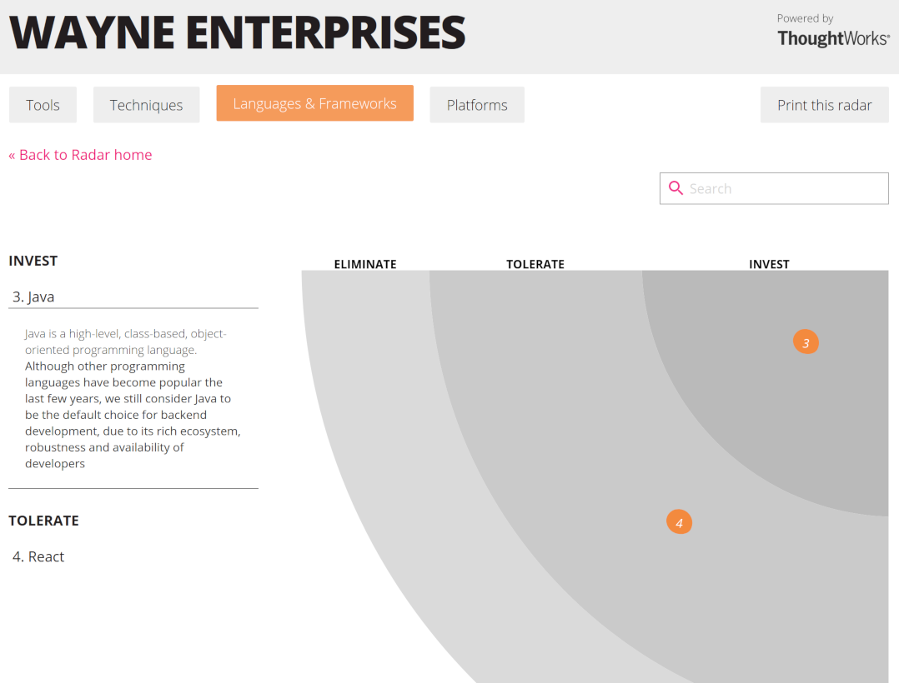

# Technology Radar

When the town plan contains a number of technologies, it is possible to generate an interactive Technology Radar. A Tech radar
can be a useful tool to guide the technology choices within an organization, and is typically based on what the development
community in the organization is experiencing.

Suppose we have the following technologies listed in the town plan:

```scala
val java: Language = ea describes Language(title = "Java") as { it =>
    it has Description("Java is a high-level, class-based, object-oriented programming language.")
    it should BeInvestedIn("Although other programming languages have become popular the last few years, we still consider Java to be the default choice for backend development, due to its rich ecosystem, robustness and availability of developers")
}

val kubernetes: Platform = ea describes Platform(title = "Kubernetes") as { it =>
    it has Description("Kubernetes is an open-source container orchestration system for automating software deployment, scaling, and management.")
    it should BeInvestedIn("For now, Kubernetes is the best bet for cloud applications, since it is supported by all major public clouds and as such leaves the door open for a multi-cloud strategy.")
}

val react: Framework = ea describes Framework(title = "React") as { it =>
    it has Description("React is a free and open-source front-end JavaScript library[3] for building user interfaces based on UI components.")
    it should BeTolerated("At Wayne Enterprises we prefer to take the HTML/CSS-first approach, rather than the Javascript-first approach made popular by SPA in recent years.")
}

val mongodb: Platform = ea describes Platform(title = "MongoDB") as { it =>
    it has Description("MongoDB is a source-available cross-platform document-oriented database program.")
    it should BeEliminated("As we are moving to a fully event-sourced architecture, we prefer a databaseless approach.")
}

val mobbing: Technique = ea describes Technique(title = "Mobbing") as { it =>
    it has Description("Mob programming (sometimes informally called mobbing or ensemble programming) is a software development approach where the whole team works on the same thing, at the same time, in the same space, and at the same computer.")
    it should BeInvestedIn("mob programming typically results in better, more readable code. It can actually speed up development and it makes sure decisions are shared by the team.")
}

val townplanner: Tool = ea describes Tool(title = "Innovenso Townplanner") as { it =>
    it has Description("Enterprise Architecture as Code")
    it should BeInvestedIn("Rather than struggling with hundreds of complicated pop-up screens in traditional EA tools, the Townplanner allows architects to model the enterprise architecture using a DSL.")
}
```

We should indicate in the main class that we want a static website:

```scala
...
object WayneEnterprisesTownPlan extends EnterpriseArchitectureAsCode {
...
  ea needs TechnologyRadar(title = "Wayne Enterprises")


  diagrams()
  website()
}

```

When we run the town planner:

    sbt run

We should get a static website in the `output/assets/website/` directory.


